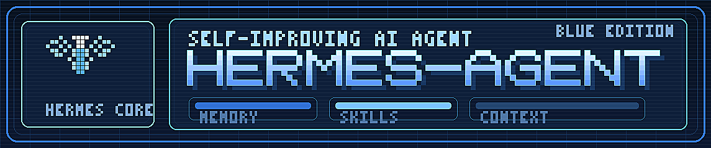

<p align="center">
  
</p>

# Hermes Agent ☤

<p align="center">
  <a href="https://hermes-agent.nousresearch.com/docs/"></a>
  <a href="https://discord.gg/NousResearch"></a>
  <a href="https://github.com/NousResearch/hermes-agent/blob/main/LICENSE"></a>
</p>

**An open-source AI agent with memory, tools, messaging, and a learning loop.**

Hermes is for people who want more than a chat window: it remembers across sessions, uses real tools, runs in the terminal or your messaging apps, and turns repeated work into reusable skills.

Bring your own model: use [Nous Portal](https://portal.nousresearch.com), [OpenRouter](https://openrouter.ai), OpenAI, or your own endpoint. Switch providers with `hermes model` — no code changes, no lock-in.

## In your first 10 minutes

- Start a terminal-native agent session with streaming tool output
- Choose a model/provider without changing code
- Enable terminal, browser, file, code execution, and delegation tools
- Talk to the same agent from chat platforms while it runs elsewhere
- Keep durable memory and reusable skills across sessions

## Get started in 2 minutes

```bash
curl -fsSL https://raw.githubusercontent.com/NousResearch/hermes-agent/main/scripts/install.sh | bash
source ~/.bashrc    # or: source ~/.zshrc
hermes model        # choose a provider/model
hermes              # start chatting
```

Runs on Linux, macOS, WSL2, and Android via Termux. The installer handles most platform-specific setup automatically.

Want messaging instead of terminal? Run `hermes gateway` after setup to connect Telegram, Discord, Slack, WhatsApp, Signal, and more.

> **Android / Termux:** The tested manual path is documented in the [Termux guide](https://hermes-agent.nousresearch.com/docs/getting-started/termux). On Termux, Hermes installs a curated `.[termux]` extra because the full `.[all]` extra currently pulls Android-incompatible voice dependencies.
>
> **Windows:** Native Windows is not supported. Please install [WSL2](https://learn.microsoft.com/en-us/windows/wsl/install) and run the command above.

## Why people stick with Hermes

- **It learns from real work** — Hermes creates skills after complex tasks, improves them during use, and reuses them later.
- **It remembers across sessions** — persistent memory and session search give it continuity instead of reset-every-time chat behavior.
- **It works where you do** — use the same agent from the CLI, Telegram, Discord, Slack, WhatsApp, Signal, Email, and more.
- **It can run unattended** — schedules, background jobs, and subagents let work continue without babysitting.
- **It runs locally or remotely** — from your laptop to Docker, SSH, Daytona, Singularity, and Modal.

## Getting Started

After install, most people do this next:

```bash
hermes model   # choose your provider and model
hermes         # start a conversation
hermes tools   # enable or review tool access
hermes gateway # connect Telegram, Discord, Slack, and more
```

Useful setup and maintenance commands:

```bash
hermes setup        # run the full setup wizard
hermes config set   # change individual config values
hermes update       # update to the latest version
hermes doctor       # diagnose issues
hermes claw migrate # migrate from OpenClaw
```

📖 **[Full documentation →](https://hermes-agent.nousresearch.com/docs/)**

## Quick Reference: CLI vs Messaging

Hermes has two main entry points: start the terminal UI with `hermes`, or run the gateway and talk to it from Telegram, Discord, Slack, WhatsApp, Signal, or Email. Many slash commands work across both.

| Action | CLI | Messaging platforms |
|---------|-----|---------------------|
| Start chatting | `hermes` | Run `hermes gateway setup` + `hermes gateway start`, then send the bot a message |
| Start fresh conversation | `/new` or `/reset` | `/new` or `/reset` |
| Change model | `/model [provider:model]` | `/model [provider:model]` |
| Set a personality | `/personality [name]` | `/personality [name]` |
| Retry or undo the last turn | `/retry`, `/undo` | `/retry`, `/undo` |
| Compress context / check usage | `/compress`, `/usage`, `/insights [--days N]` | `/compress`, `/usage`, `/insights [days]` |
| Browse skills | `/skills` or `/<skill-name>` | `/skills` or `/<skill-name>` |
| Interrupt current work | `Ctrl+C` or send a new message | `/stop` or send a new message |
| Platform-specific status | `/platforms` | `/status`, `/sethome` |

For the full command lists, see the [CLI guide](https://hermes-agent.nousresearch.com/docs/user-guide/cli) and the [Messaging Gateway guide](https://hermes-agent.nousresearch.com/docs/user-guide/messaging).

## Capabilities in depth

<table>
<tr><td><b>A real terminal interface</b></td><td>Full TUI with multiline editing, slash-command autocomplete, conversation history, interrupt-and-redirect, and streaming tool output.</td></tr>
<tr><td><b>Lives where you do</b></td><td>Telegram, Discord, Slack, WhatsApp, Signal, and CLI — all from a single gateway process. Voice memo transcription, cross-platform conversation continuity.</td></tr>
<tr><td><b>A closed learning loop</b></td><td>Agent-curated memory with periodic nudges. Autonomous skill creation after complex tasks. Skills self-improve during use. FTS5 session search with LLM summarization for cross-session recall. <a href="https://github.com/plastic-labs/honcho">Honcho</a> dialectic user modeling. Compatible with the <a href="https://agentskills.io">agentskills.io</a> open standard.</td></tr>
<tr><td><b>Scheduled automations</b></td><td>Built-in cron scheduler with delivery to any platform. Daily reports, nightly backups, weekly audits — all in natural language, running unattended.</td></tr>
<tr><td><b>Delegates and parallelizes</b></td><td>Spawn isolated subagents for parallel workstreams. Write Python scripts that call tools via RPC, collapsing multi-step pipelines into zero-context-cost turns.</td></tr>
<tr><td><b>Runs anywhere, not just your laptop</b></td><td>Six terminal backends — local, Docker, SSH, Daytona, Singularity, and Modal. Daytona and Modal offer serverless persistence — your agent's environment hibernates when idle and wakes on demand, costing nearly nothing between sessions.</td></tr>
<tr><td><b>Research-ready</b></td><td>Batch trajectory generation, Atropos RL environments, trajectory compression for training the next generation of tool-calling models.</td></tr>
</table>

---

## Documentation

All documentation lives at **[hermes-agent.nousresearch.com/docs](https://hermes-agent.nousresearch.com/docs/)**:

| Section | What's Covered |
|---------|---------------|
| [Quickstart](https://hermes-agent.nousresearch.com/docs/getting-started/quickstart) | Install → setup → first conversation in 2 minutes |
| [CLI Usage](https://hermes-agent.nousresearch.com/docs/user-guide/cli) | Commands, keybindings, personalities, sessions |
| [Configuration](https://hermes-agent.nousresearch.com/docs/user-guide/configuration) | Config file, providers, models, all options |
| [Messaging Gateway](https://hermes-agent.nousresearch.com/docs/user-guide/messaging) | Telegram, Discord, Slack, WhatsApp, Signal, Home Assistant |
| [Security](https://hermes-agent.nousresearch.com/docs/user-guide/security) | Command approval, DM pairing, container isolation |
| [Tools & Toolsets](https://hermes-agent.nousresearch.com/docs/user-guide/features/tools) | 40+ tools, toolset system, terminal backends |
| [Skills System](https://hermes-agent.nousresearch.com/docs/user-guide/features/skills) | Procedural memory, Skills Hub, creating skills |
| [Memory](https://hermes-agent.nousresearch.com/docs/user-guide/features/memory) | Persistent memory, user profiles, best practices |
| [MCP Integration](https://hermes-agent.nousresearch.com/docs/user-guide/features/mcp) | Connect any MCP server for extended capabilities |
| [Cron Scheduling](https://hermes-agent.nousresearch.com/docs/user-guide/features/cron) | Scheduled tasks with platform delivery |
| [Context Files](https://hermes-agent.nousresearch.com/docs/user-guide/features/context-files) | Project context that shapes every conversation |
| [Architecture](https://hermes-agent.nousresearch.com/docs/developer-guide/architecture) | Project structure, agent loop, key classes |
| [Contributing](https://hermes-agent.nousresearch.com/docs/developer-guide/contributing) | Development setup, PR process, code style |
| [CLI Reference](https://hermes-agent.nousresearch.com/docs/reference/cli-commands) | All commands and flags |
| [Environment Variables](https://hermes-agent.nousresearch.com/docs/reference/environment-variables) | Complete env var reference |

---

## Migrating from OpenClaw

If you're coming from OpenClaw, Hermes can automatically import your settings, memories, skills, and API keys.

**During first-time setup:** The setup wizard (`hermes setup`) automatically detects `~/.openclaw` and offers to migrate before configuration begins.

**Anytime after install:**

```bash
hermes claw migrate              # Interactive migration (full preset)
hermes claw migrate --dry-run    # Preview what would be migrated
hermes claw migrate --preset user-data   # Migrate without secrets
hermes claw migrate --overwrite  # Overwrite existing conflicts
```

What gets imported:
- **SOUL.md** — persona file
- **Memories** — MEMORY.md and USER.md entries
- **Skills** — user-created skills → `~/.hermes/skills/openclaw-imports/`
- **Command allowlist** — approval patterns
- **Messaging settings** — platform configs, allowed users, working directory
- **API keys** — allowlisted secrets (Telegram, OpenRouter, OpenAI, Anthropic, ElevenLabs)
- **TTS assets** — workspace audio files
- **Workspace instructions** — AGENTS.md (with `--workspace-target`)

See `hermes claw migrate --help` for all options, or use the `openclaw-migration` skill for an interactive agent-guided migration with dry-run previews.

---

## Contributing

We welcome contributions! See the [Contributing Guide](https://hermes-agent.nousresearch.com/docs/developer-guide/contributing) for development setup, code style, and PR process.

Quick start for contributors:

```bash
git clone https://github.com/NousResearch/hermes-agent.git
cd hermes-agent
curl -LsSf https://astral.sh/uv/install.sh | sh
uv venv venv --python 3.11
source venv/bin/activate
uv pip install -e ".[all,dev]"
python -m pytest tests/ -q
```

> **RL Training (optional):** To work on the RL/Tinker-Atropos integration:
> ```bash
> git submodule update --init tinker-atropos
> uv pip install -e "./tinker-atropos"
> ```

---

## Community

- 💬 [Discord](https://discord.gg/NousResearch)
- 📚 [Skills Hub](https://agentskills.io)
- 🐛 [Issues](https://github.com/NousResearch/hermes-agent/issues)
- 💡 [Discussions](https://github.com/NousResearch/hermes-agent/discussions)
- 🔌 [HermesClaw](https://github.com/AaronWong1999/hermesclaw) — Community WeChat bridge: Run Hermes Agent and OpenClaw on the same WeChat account.

---

## License

MIT — see [LICENSE](LICENSE).

Built by [Nous Research](https://nousresearch.com).
